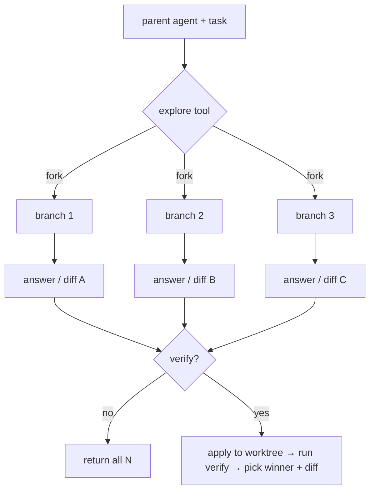

[English](README.md) | [中文](README.zh.md)

# dsh-explore

**Trajectory-level parallel exploration for [DeepSeek Harness](https://github.com/deepseek-ai/deepseek-harness) agents.**

[](LICENSE)
[](https://github.com/topics/dsh-plugin)
[](https://github.com/deepseek-ai/deepseek-harness)

When you need more than one answer, `dsh-explore` forks your agent into **N parallel branches** — each inherits your full conversation context and independently explores a different approach — then returns all their answers, or (with a verifier) picks and explains a winner.

## ✨ Features

- **`explore` tool** — fork N subagents in parallel and get N genuinely different answers.
- **Execution-grounded verification** (`verify`) — run a real command against each branch and keep the one that passes. Never trusts an agent's self-report.
- **Winner diff** — explains *why* the winner won: shared prefix → divergent tool calls → error counts.
- **MCTS tree search** (`mode: 'mcts'`) — iterate: fork → verify → backprop → re-select → branch deeper from the best partial trajectories.
- **Deterministic isolation** — branches share no mutable state; dsh's `fork` seeds each child from the parent's exact completed-turn prefix.

## 🚀 Quick start

```sh
# from npm (recommended)
dsh plugin --profile web add dsh-explore

# or from a local checkout
dsh plugin --profile web add ./packages/plugin

# restart dsh web, then in a session ask the model:
#   "用 explore 工具，探索 3 种不同的方案解决 …"
```

## 🧭 How it works



- **Without `verify`** — branches answer the inherited task in one message (v0, tool-free, reliable today).
- **With `verify`** — branches propose a unified diff (read-only); each diff is applied to an isolated `git worktree`, verified, and the winner is selected (v1).

## 📦 Packages

| Package | What it is |
|---|---|
| `packages/core` | Pure, dependency-free algorithms: `bestOfN`, `mcts`, UCT, `verdictFromRun`, `diffTrajectories`, `extractPatch`, `selectBest`. 18 unit tests. |
| `packages/plugin` | The dsh bundle wiring core to `ctx.subagents` / `ctx.tools` / `ctx.shell`. Bundled to a single `dist/index.js` with **zero `@deepseek-ai/*` import at runtime**. |

## ❓ Why a tool, not a slash command

dsh's own `subagent` tool forks children from `exec.agent` inside the agent loop — the only context where `child.whenIdle()` reaches quiescence. A slash-command handler forking subagents never resolves `SubagentRun.result` in the current preview, so this plugin follows the same contract: it's a **tool**.

## 📚 Grounding

[LATS](https://arxiv.org/abs/2310.04406) (MCTS over language-agent trajectories) · [Agent Q](https://arxiv.org/abs/2408.07199) (environment reward; self-critique only as a guide) · best-of-N with execution verifiers (EvoScale / μ Code / SWE-bench) · [ParallelEnv](https://www.caisconf.org/program/2026/demos/parallel-environments-for-agents/) (tree-forking over isolated environments).

## 🗺️ Roadmap

- [x] M0 — fork mechanism verified (tool path)
- [x] M1 — core search library (`bestOfN` / `mcts` / UCT)
- [x] M2 — `explore` tool, fork N in parallel
- [x] M3 — execution verifier (`ctx.shell` → verdict)
- [x] M4 — winner diff + propose-mode + worktree verifier (v1)
- [x] MCTS — real tree search (`mode: 'mcts'`, mid-trajectory branching)
- [ ] live — worktree + MCTS end-to-end (needs live test)
- [x] M5 — npm publish (`dsh-explore` + `dsh-explore-core`) + `dsh plugin add dsh-explore`

## ⚠️ Status

Developer preview. dsh pins `SESSION_FORMAT_VERSION = 0` with no compatibility promise; `dsh-explore` tracks the preview line.

## License

[MIT](LICENSE)
