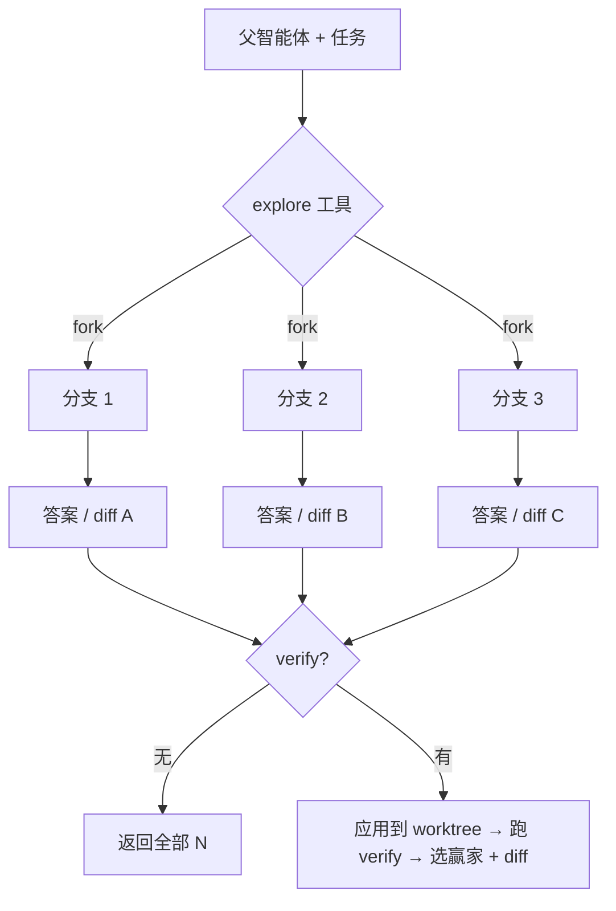

[English](README.md) | 中文

# dsh-explore

**面向 [DeepSeek Harness](https://github.com/deepseek-ai/deepseek-harness) 智能体的轨迹级并行探索。**

[](LICENSE)
[](https://github.com/topics/dsh-plugin)
[](https://github.com/deepseek-ai/deepseek-harness)

当你需要不止一个答案时，`dsh-explore` 把你的智能体**分叉成 N 个并行分支**——每个分支都继承完整对话上下文、独立探索不同思路——然后返回所有答案，或（在有验证器时）选出并解释一个赢家。

## ✨ 特性

- **`explore` 工具** —— 并行 fork N 个子智能体，得到 N 个真正不同的答案。
- **基于执行的验证**（`verify`）—— 对每个分支跑真实命令，保留通过的那个，绝不信智能体自述。
- **赢家 diff** —— 解释「赢家为什么赢」：共享前缀 → 分歧的工具调用 → 错误计数。
- **MCTS 树搜索**（`mode: 'mcts'`）—— 迭代：分叉 → 验证 → 回溯 → 重选 → 从最佳部分轨迹继续深分叉。
- **确定性隔离** —— 分支间无共享可变状态；dsh 的 `fork` 用父会话精确的已完成轮次前缀做种子。

## 🚀 快速开始

```sh
# 从本地 checkout 安装
dsh plugin --profile web add ./packages/plugin

# 重启 dsh web，然后在会话里对模型说：
#   "用 explore 工具，探索 3 种不同的方案解决 …"
```

## 🧭 工作原理



- **不带 `verify`** —— 分支用一条消息回答继承的任务（v0，无工具，当前稳定可靠）。
- **带 `verify`** —— 分支只读地输出 unified diff；每个 diff 被应用到独立的 `git worktree`，验证后选出赢家（v1）。

## 📦 包结构

| 包 | 说明 |
|---|---|
| `packages/core` | 纯算法库、零依赖：`bestOfN`、`mcts`、UCT、`verdictFromRun`、`diffTrajectories`、`extractPatch`、`selectBest`。18 个单测。 |
| `packages/plugin` | dsh bundle，把 core 接到 `ctx.subagents` / `ctx.tools` / `ctx.shell`。打包成单个 `dist/index.js`，**运行时零 `@deepseek-ai/*` 导入**。 |

## ❓ 为什么是工具，而不是斜杠命令

dsh 自带的 `subagent` 工具在 agent loop 内部用 `exec.agent` fork 子智能体——这是唯一能让 `child.whenIdle()` 达到静默的上下文。斜杠命令 handler 里 fork 子智能体，`SubagentRun.result` 在当前 preview 中永远不会 resolve，所以本插件遵循同样的契约：它是一个**工具**。

## 📚 理论基础

[LATS](https://arxiv.org/abs/2310.04406)（语言智能体轨迹上的 MCTS）· [Agent Q](https://arxiv.org/abs/2408.07199)（环境奖励；自我批判仅作引导）· 带执行验证器的 best-of-N（EvoScale / μ Code / SWE-bench）· [ParallelEnv](https://www.caisconf.org/program/2026/demos/parallel-environments-for-agents/)（隔离环境上的树分叉）。

## 🗺️ 路线图

- [x] M0 —— fork 机制验证（工具路径）
- [x] M1 —— 核心搜索库（`bestOfN` / `mcts` / UCT）
- [x] M2 —— `explore` 工具，并行 fork N
- [x] M3 —— 执行验证器（`ctx.shell` → verdict）
- [x] M4 —— 赢家 diff + propose 模式 + worktree 验证器（v1）
- [x] MCTS —— 真树搜索（`mode: 'mcts'`，mid-trajectory 分叉）
- [ ] live —— worktree + MCTS 端到端（需 live 测试）
- [ ] M5 —— npm 发布 + `dsh plugin add dsh-explore`

## ⚠️ 状态

开发者预览版。dsh 将 `SESSION_FORMAT_VERSION` 固定在 0，不承诺兼容性；`dsh-explore` 跟随 preview 线。

## 许可证

[MIT](LICENSE)
